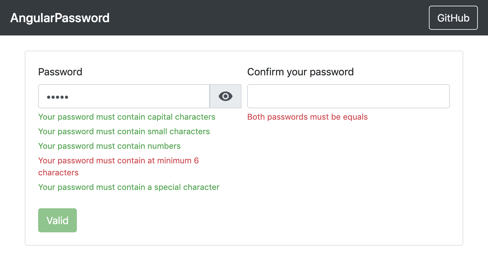

# AngularPassword

Este projeto implementa uma validação de senhas.  Pode ser utilizado quando se deseja validar a senha do usuário quando este está realizando o seu cadastro no sistema.

Nesta implementação, o usuário deve digitar uma senha que contenha caracteres maiúsculos e minúsculos, números e caracteres especiais, além de ter no seis ou mais caracteres para ter uma senha válida. É necessário também que ele digite uma segunda vez a senha.

